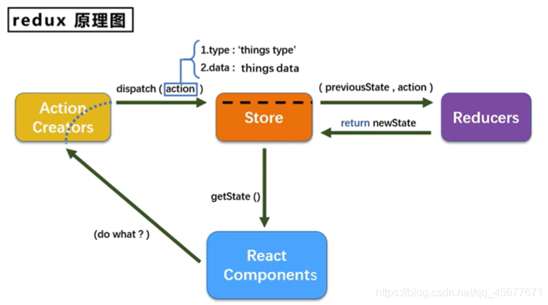

# Redux

<details>

<summary>Elements</summary>

* <mark style="color:yellow;">**Actions**</mark>: JavaScript <mark style="color:blue;">**objects**</mark>, which <mark style="color:orange;">**describe state changes in the application**</mark>
* <mark style="color:yellow;">**Action creators**</mark>: <mark style="color:blue;">**Functions**</mark> that take some arguments and <mark style="color:orange;">**return an action**</mark>
* <mark style="color:yellow;">**Reducers**</mark>: <mark style="color:blue;">**Functions**</mark> that <mark style="color:orange;">**take the current state and an action**</mark>, and <mark style="color:orange;">**return the new state**</mark>\ <mark style="color:orange;">**=>**</mark> functions specify how to transform application state.
* <mark style="color:yellow;">**Store**</mark>: The heart of Redux, which actually stores and guards your application state; \
  we can subscribe to state changes in the store and dispatch actions to it.
  * Access the application state: <mark style="color:orange;">**store.getState()**</mark>
  * Dispatch actions: <mark style="color:orange;">**store.dispatch(action)**</mark>
  * Store can be updated only with actions( an object describing an event)

</details>



<details>

<summary>Connecting React &#x26;  app with Redux: Hooks &#x26; Provider</summary>

* We can use Redux with any library: React, Angular, Ember, jQuery, or even vanilla JavaScript.&#x20;
* Connecting a component to Redux will allow us to <mark style="color:purple;">**replace React's internal state management with Redux' state management.**</mark>&#x20;
* <mark style="color:yellow;">**Redux Hooks**</mark>:&#x20;
  * 属于：part of the `react-redux` library, which is the official React binding for Redux.
  * 位置：used in React component&#x20;
  * 作用：allow you to <mark style="color:purple;">**interact with a Redux store**</mark> <mark style="color:yellow;">**directly**</mark> from your <mark style="color:purple;">**React components.**</mark>&#x20;
  * 分类：
    * **`useSelector():`** extract data from the Redux store state, using a selector function
    * **`useDispatch():`** returns a reference to the dispatch function from the Redux store. You may use it to dispatch actions as needed.
* <mark style="color:yellow;">**Provider**</mark>
  * `属于：Provider` is a React component provided by the `react-redux` library.
  * 位置：used in app.js
  * 作用： It <mark style="color:purple;">**makes the Redux store available to  nested components**</mark> that need to access Redux state, or dispatch actions to the store.

</details>

<details>

<summary>Workflow</summary>

* &#x20;      <mark style="background-color:orange;">**Redux Side**</mark>         &#x20;
  * <mark style="color:red;">**Actions:**</mark> create actions/<mark style="color:yellow;">**action.js**</mark>&#x20;
    * define action types
    * define action creators
  * <mark style="color:red;">**Reducer:**</mark> create reducers/<mark style="color:yellow;">**reducer.js**</mark>
    * _<mark style="color:purple;">import actions from action.js</mark> <mark style="color:purple;"></mark><mark style="color:purple;">**=>**</mark><mark style="color:yellow;">**要根据action type来定义operation**</mark>_
    * define reducer functions: \
      params: state and action\
      return: new state
  * <mark style="color:red;">**Store:**</mark> create redux store: <mark style="color:yellow;">**store.js**</mark>
    * _<mark style="color:orange;">import { createStore } from 'redux';</mark>_
    * _<mark style="color:purple;">import reducer from reducer.js</mark>_
    * call  createStore(importedCorrespondedReducer) and export the store
* &#x20;           <mark style="background-color:orange;">**React Side**</mark> in the component
  * import hooks: _<mark style="color:orange;">import { useSelector, useDispatch } from 'react-redux';</mark>_
  * _<mark style="color:purple;">Import action creators from action.js.</mark>_
  * Use the `useSelector` hook to access state from the Redux store.
  * Use the `useDispatch` hook to dispatch actions to the Redux store.
  * `useDispatch`和`useSelector`这两个hook在React组件和Redux store之间建立了一个实时的、双向的连接，让你可以实时地更新状态并在界面上反映出这些更新

<!---->

* an action is dispatched to store \
  \=> Redux call corresponded reducer => pass current state and action as params to reducer\
  \=> reducer check the action type => decide how to update the state => return  new state

</details>

<details>

<summary>Demo</summary>

&#x20;      <mark style="background-color:orange;">**Redux Side**</mark>         &#x20;

1.  **Create Actions (`actions.js`):**

    * Define **action types** (e.g., `SET_USER`, `ADD_POST`).
    * Define **action creators** (e.g., `setUser(user)`, `addPost(post)`).


    ```javascript
    // actions.js
    export const SET_USER = 'SET_USER';
    export const ADD_POST = 'ADD_POST';

    // action creators
    export const setUser = (user) => ({ type: SET_USER, 
                                        payload: user });
    export const addPost = (post) => ({ type: ADD_POST, 
                                         payload: post });
    ```
2.  **Create Reducers (`reducer.js`):**

    * Import action types from `actions.js`.
    * Define initial state.
    * Define reducer function (e.g., `appReducer`), which takes the current `state` and an `action` as parameters, and returns a new state based on the action type.

    ```javascript
    // reducer.js
    import { SET_USER, ADD_POST } from './actions';

    const initialState = {
      user: null,
      posts: [],
    };

    export const appReducer = (state = initialState, action) => {
      switch (action.type) {
        case SET_USER:
          return { ...state, 
                   user: action.payload };
        case ADD_POST:
          return { ...state, 
                   posts: [...state.posts, action.payload] };
        default:
          return state;
      }
    };
    ```
3.  **Create Redux Store (`store.js`):**

    * Import `createStore` from 'redux'.
    * Import the reducer from `reducer.js`.
    * Call `createStore(appReducer)` to create the store.
    * Export the created store.

    ```javascript
    // store.js
    import { createStore } from 'redux';
    import { appReducer } from './reducer';

    export const store = createStore(appReducer);
    ```


&#x20;          <mark style="background-color:orange;">**React Side**</mark>&#x20;

1.  **Connect Redux to React (`index.js` or `App.js`):**

    * Import `Provider` from 'react-redux'. The `Provider` component makes the Redux store available to all child components in the component tree.
    * Import the Redux store from `store.js`.
    * Wrap the root component of the React application with the `Provider` component, passing the Redux store as a prop.

    ```javascript
    // App.js
    import React from 'react';
    import { Provider } from 'react-redux';
    // import Redux store
    import { store } from './store';
    // import React components
    import UserProfile from './UserProfile';
    import Posts from './Posts';

    const App = () => {
      return (
        <Provider store={store}>
          <UserProfile />
          <Posts />
        </Provider>
      );
    };

    export default App;
    ```
2. **In the Component (`UserProfile.js`, `Posts.js`):**
   * Import `useSelector` and `useDispatch` hooks from 'react-redux'.
   * Import action creators from `actions.js`.
   * Use the `useSelector` hook to read data from the Redux store. This hook takes a selector function as an argument, where the selector function selects the part of the state that the component needs.
   * Use the `useDispatch` hook to get the `dispatch` function. This function can dispatch actions to the Redux store.
   * Use the action creators imported from `actions.js` with the `dispatch` function to dispatch actions.
   * Remember to handle the state data from `useSelector` in the component's render method, and link any user interactions to dispatching actions to the Redux store.

```javascript
// UserProfile.js
import React from 'react';
import { useSelector, useDispatch } from 'react-redux';
import { setUser } from './actions';

const UserProfile = () => {
  // 使用useSelector从Redux store中选取user状态
  // 这里的state.user是在reducer中定义的
  const user = useSelector(state => state.user); 
  const dispatch = useDispatch();

  const updateUser = () => {
    dispatch(setUser({ name: 'Alice', age: 25 }));
  };

  return (
    <div>
      <button onClick={updateUser}>Update User</button>
      <div>Name: {user?.name}</div>
      <div>Age: {user?.age}</div>
    </div>
  );
};

export default UserProfile;

// Posts.js
import React from 'react';
import { useSelector, useDispatch } from 'react-redux';
import { addPost } from './actions';

const Posts = () => {
  const posts = useSelector(state => state.posts);
  const dispatch = useDispatch();

  const addNewPost = () => {
    dispatch(addPost({ id: Date.now(), 
                       title: 'New Post', 
                       content: 'This is a new post.' 
                       }
                     ));
  };

  return (
    <div>
      <button onClick={addNewPost}>Add Post</button>
      {posts.map(post => (
        <div key={post.id}>
          <h2>{post.title}</h2>
          <p>{post.content}</p>
        </div>
      ))}
    </div>
  );
};

export default Posts;
```


</details>
